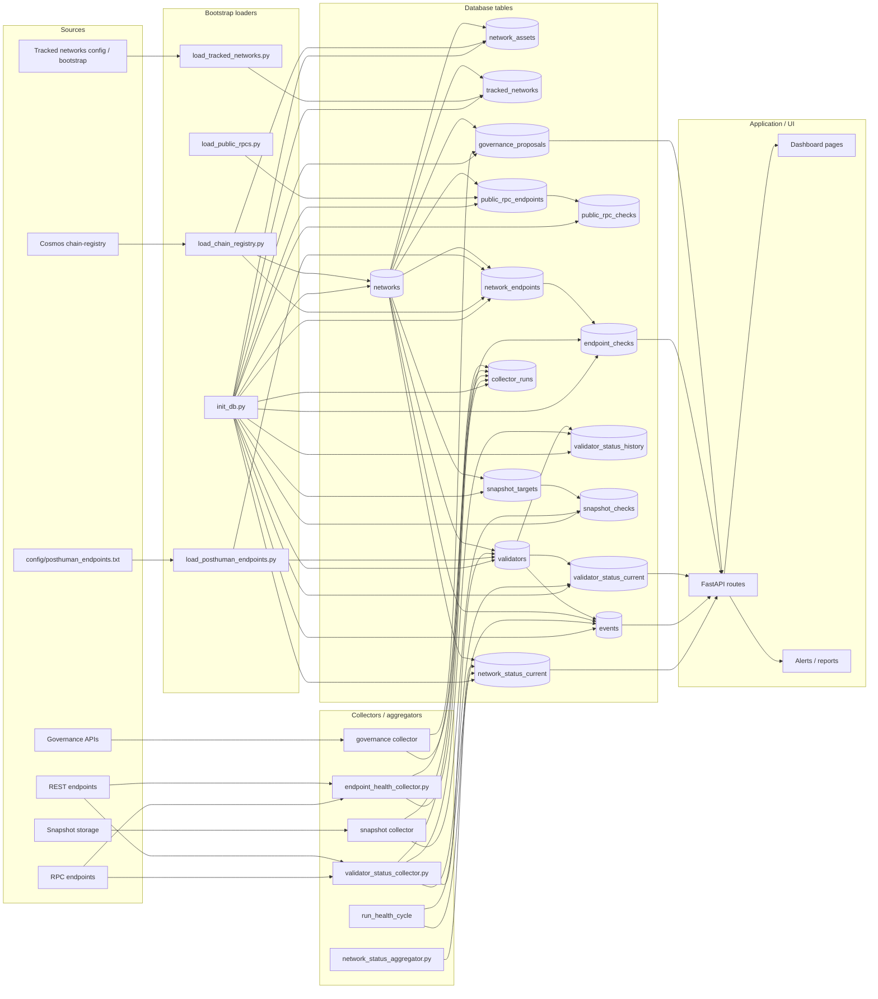
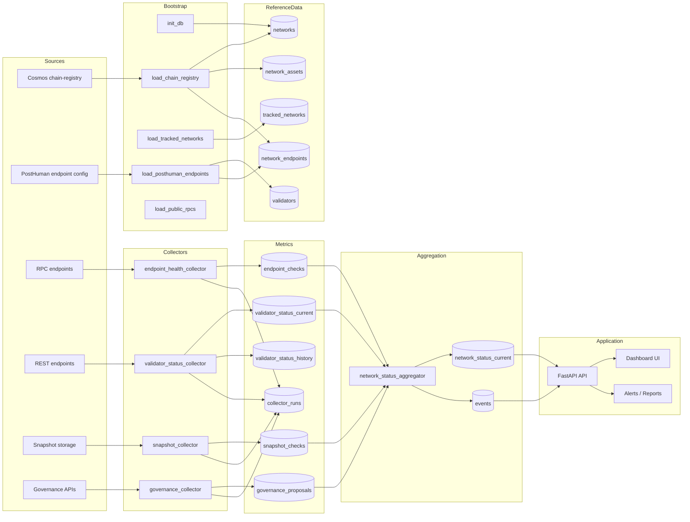
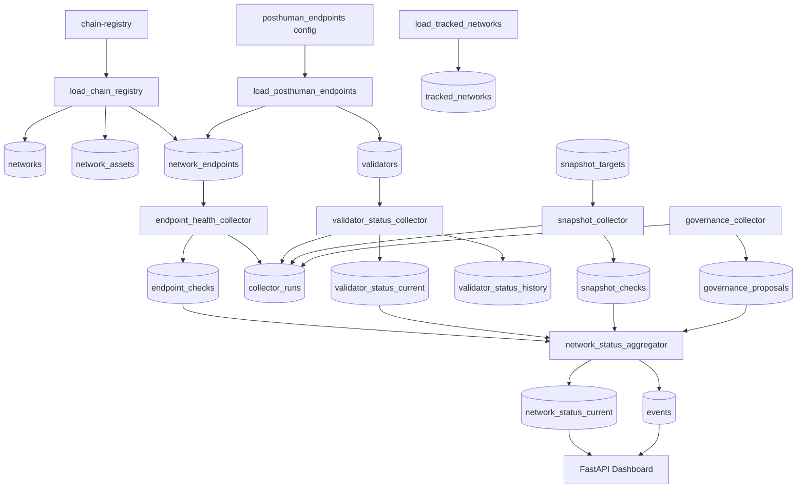

# Validator Dashboard

Monitoring panel for Cosmos validator infrastructure.

Features:

- validator monitoring
- RPC health checks
- commission tracking
- rewards reporting
- alert events

Tech stack:

- Python
- FastAPI
- SQLite
- Jinja2

## Database schema and data flow



---

## 2) ASCII-схема для терминала / документации

```md
## Database schema and data flow (ASCII)

```text
                             +----------------------+
                             |  Cosmos chain-registry |
                             +-----------+----------+
                                         |
                                         v
                              +----------------------+
                              | load_chain_registry  |
                              +----+-----------+-----+
                                   |           |
                                   |           |
                                   v           v
                           +-----------+   +-----------+
                           | networks  |-->|network_assets|
                           +-----+-----+   +-------------+
                                 |
                                 v
                         +---------------+
                         |network_endpoints|
                         +-------+-------+
                                 |
                                 |
               +-----------------+------------------+
               |                                    |
               v                                    v
     +----------------------+             +----------------------+
     | endpoint_health_     |             | load_public_rpcs.py  |
     | collector.py         |             +----------+-----------+
     +----------+-----------+                        |
                |                                    v
                v                           +----------------------+
       +-------------------+                | public_rpc_endpoints |
       | endpoint_checks   |                +----------+-----------+
       +-------------------+                           |
                |                                      v
                |                             +-------------------+
                |                             | public_rpc_checks |
                |                             +-------------------+
                |
                v
       +-------------------+
       | collector_runs    |
       +-------------------+


+------------------------------+
| config/posthuman_endpoints   |
+---------------+--------------+
                |
                v
    +-------------------------------+
    | load_posthuman_endpoints.py   |
    +-------------+-----------------+
                  | 
                  +------------------------+
                  |                        |
                  v                        v
          +---------------+        +------------------+
          | validators    |        | network_endpoints|
          +-------+-------+        +------------------+
                  |
                  v
      +-----------------------------+
      | validator_status_collector  |
      +---------+----------+--------+
                |          |
                |          |
                v          v
     +----------------+   +------------------------+
     |validator_status|   |validator_status_history|
     |_current        |   +------------------------+
     +--------+-------+
              |
              v
      +-------------------+
      | collector_runs    |
      +-------------------+


+------------------------------+
| load_tracked_networks.py     |
+---------------+--------------+
                |
                v
        +------------------+
        | tracked_networks |
        +------------------+


+------------------------------+
| snapshot_targets            |
+---------------+--------------+
                |
                v
      +------------------------+
      | snapshot collector     |
      +-----------+------------+
                  |
                  v
          +------------------+
          | snapshot_checks  |
          +------------------+


+------------------------------+
| governance collector         |
+---------------+--------------+
                |
                v
       +-----------------------+
       | governance_proposals  |
       +-----------------------+


                    +------------------------------+
                    | network_status_aggregator.py |
                    +---------------+--------------+
                                    |
                                    v
                         +------------------------+
                         | network_status_current |
                         +-----------+------------+
                                     |
                                     v
                           +----------------------+
                           | FastAPI / Dashboard  |
                           +----------+-----------+
                                      |
                 +--------------------+--------------------+
                 |                                         |
                 v                                         v
        +------------------+                      +------------------+
        | dashboard pages  |                      | alerts / reports |
        +------------------+                      +------------------+


Additional event flow:
----------------------
run_health_cycle
      |
      v
+------------+
|  events    |
+------------+
      |
      v
FastAPI / Dashboard


## System Architecture




## Monitoring Data Pipeline




